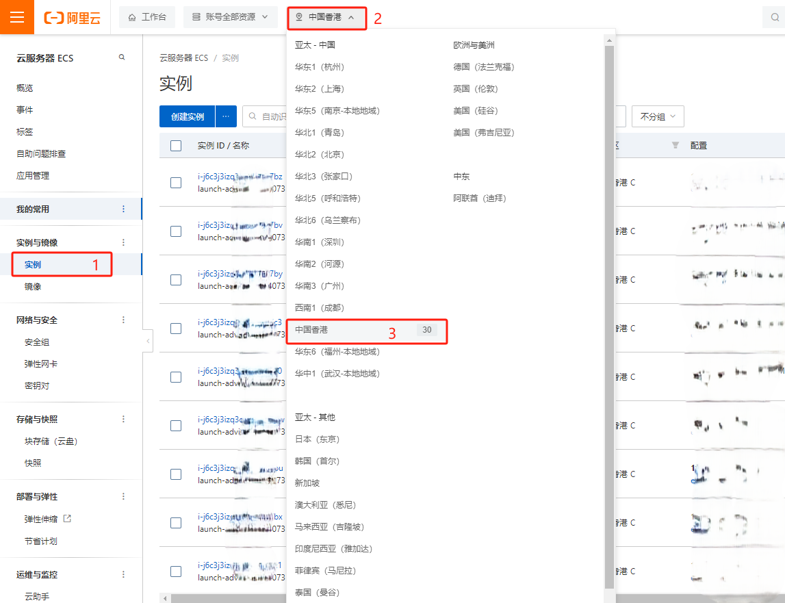
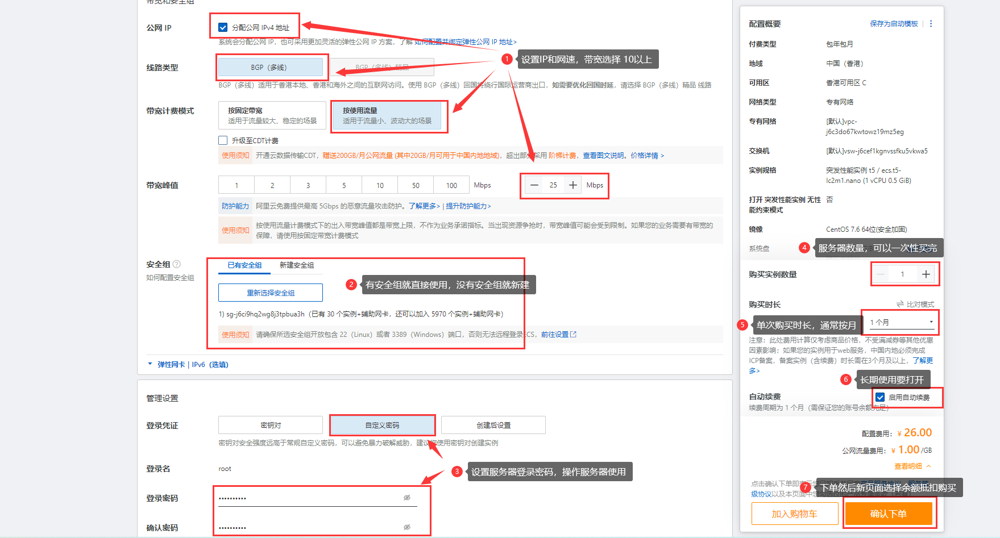

## 服务器购买
**1)** 登录账号后点击右上角 “菜单->云服务器ECS“ 或链接 [https://ecs.console.aliyun.com/home#/](https://ecs.console.aliyun.com/home#/) 打开服务器控制台

**2)** 点击服务器控制台左侧 “实例“，选择 左上角地区(如香港) 进入对于地区服务器管理

**3)** 点击 “创建实例” 按钮进入服务器购买界面

