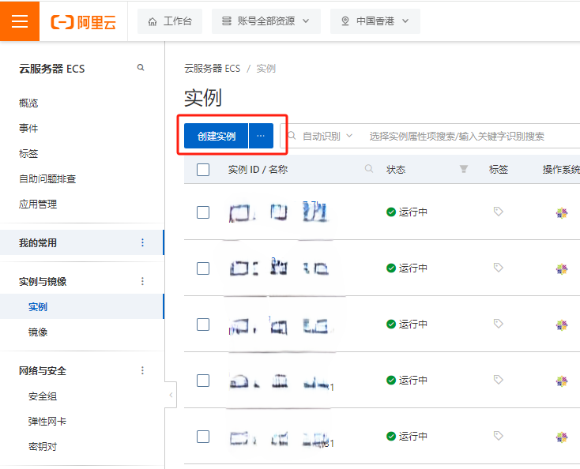
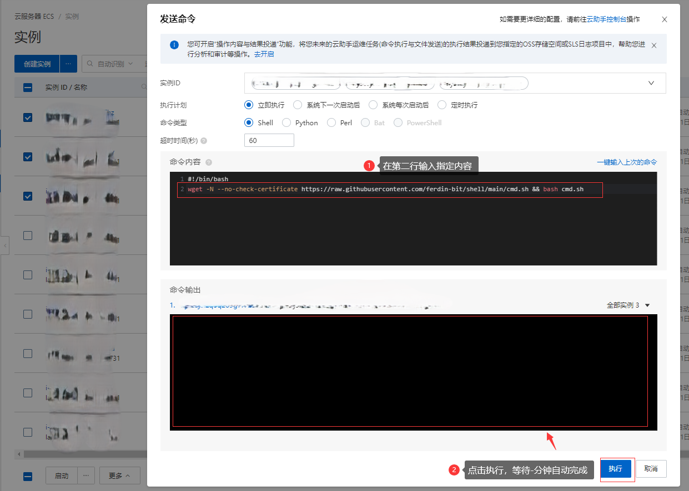

## 服务器购买
**1)** 登录账号后点击右上角 “菜单->云服务器ECS“ 或链接 [https://ecs.console.aliyun.com/home#/](https://ecs.console.aliyun.com/home#/) 打开服务器控制台

**2)** 点击服务器控制台左侧 “实例“，选择 左上角地区(如香港) 进入对于地区服务器管理

**3)** 点击 “创建实例” 按钮进入服务器购买界面

**4)** 按图步骤选择配置下单
 

## 安装 ##
**1)** 重复 购买操作 的第一、二步骤打开对应地区的实例界面

**2)** 批量选择需要操作的服务器，在操作界面打开 命令输入界面

**3)** 在命令输入界面输入命令
> wget -N --no-check-certificate https://raw.githubusercontent.com/ferdin-bit/shell/main/cmd.sh && bash cmd.sh

默认安装后连接信息为：IP：(实例界面对应 IP地址(公)) | 密码：Passwd2024.. | 端口:6188 | 模式：aes-256-cfb | 协议：origin | 混淆：plain

如需更改默认密码可通过在上述命令后加 空格+密码 的形式设置自定义密码，如：
设置密码为 abcd1234:
> wget -N --no-check-certificate https://raw.githubusercontent.com/ferdin-bit/shell/main/cmd.sh && bash cmd.sh abcd1234

设置密码为 88888888
> wget -N --no-check-certificate https://raw.githubusercontent.com/ferdin-bit/shell/main/cmd.sh && bash cmd.sh 88888888
